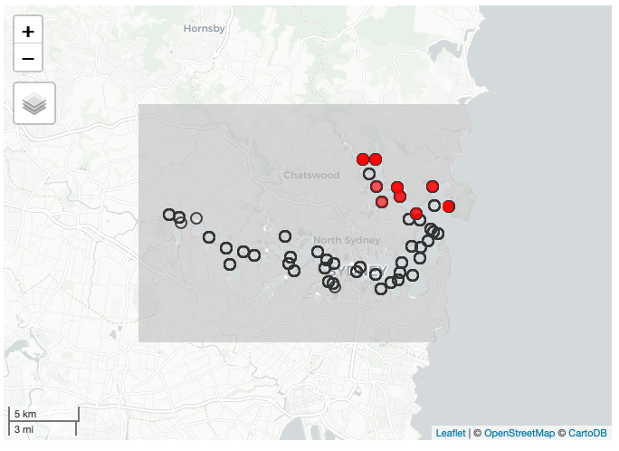
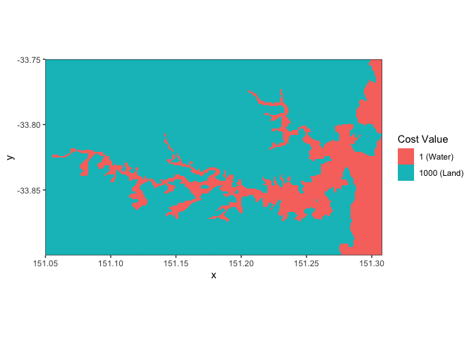
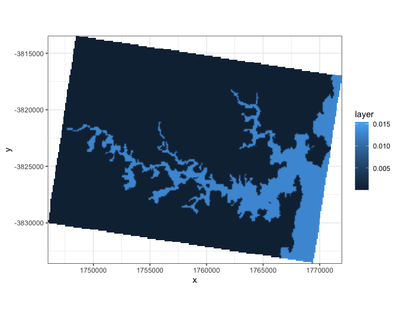
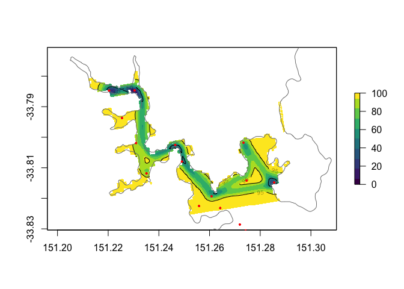
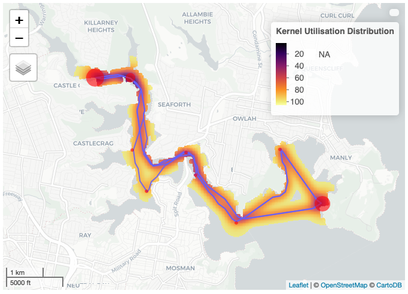

Quick guide to use `lcDistance` functions
===================================

<br>

Load packages
---------

```r
library(tidyverse)
library(sf)
library(raster)
library(mapview)

## Installing VTrack from github if you dont have the recent version
# devtools::install_github("rossdwyer/VTrack")
library(VTrack)
source("2020-03-28_lcDistance.R")
```
<br>

Input example datasets
---------

```r
map <- readRDS("data/Example_map.RDS")
statinfo <- readRDS("data/Example_statinfo.RDS")
tagdata <- readRDS("data/Example_tagdata.RDS")
taginfo <- readRDS("data/Example_taginfo.RDS")

ATTdata <- setupData(Tag.Detections = tagdata, 
                     Tag.Metadata = taginfo,
                     Station.Information =  statinfo, 
                     source = "IMOS")

COAdata <- COA(ATTdata)
```
<br>

Quick visualisation of the raw data
---------

```r
statinfo.sp <- 
  statinfo %>% 
  st_as_sf(coords=c("station_longitude", "station_latitude"), crs=4326)

coa.data <-
  COAdata %>% 
  st_as_sf(coords=c("Longitude.coa", "Latitude.coa"), crs=4326)

mapview(statinfo.sp, layer = "Receivers", legend = F, homebutton = F, alpha.regions = 0) +
  mapview(map, alpha = 0, col.regions = "grey", legend =F, layer = "Coastline polygon", homebutton = F) +
  mapview(coa.data, layer = "COA positions", legend =F, homebutton = F, alpha = 0, col.regions = 2, size = 2)
```


<br>

If your using your own cost layer, this is how to make one from a polygon shapefile of land/coastline

```{r}
cost.raster <- rasterize(map, raster(extent(map), resolution = 0.001), 1000)
cost.raster[is.na(values(cost.raster))] <- 1
projection(cost.raster) <- CRS("+init=epsg:4326")

cost.raster %>% 
  rasterToPoints(.) %>%
  as_tibble() %>% 
  ggplot() +
  geom_raster(aes(x = x, y = y, fill = factor(layer))) +
  coord_fixed(expand = 0) +
  scale_fill_discrete(name = "Cost Value", labels = c("1 (Water)", "1000 (Land)")) +
  theme_bw()
  
```


<br>

Create a transition layer to speed up UD estimation if using lots of individuals in the same study site. If not provided the function just calculates it the same way using the cost layer, but that takes up additional time.

```{r}
cost.in_utm <- projectRaster(cost.raster, crs = CRS("+init=epsg:3577"), method = "ngb")
cost.ras <- resample(cost.in_utm, raster(extent(cost.in_utm), res = 50), method = "ngb")
projection(cost.ras) <- CRS("+init=epsg:3577")

trCost <- transition(1/cost.ras, mean, directions = 16)
trans.utm <- geoCorrection(trCost, type = "c")

trans.utm %>% 
  raster() %>% 
  rasterToPoints(.) %>%
  as_tibble() %>% 
  ggplot() +
  geom_raster(aes(x = x, y = y, fill = layer)) +
  coord_fixed(expand = 0) +
  theme_bw()
```


<br><br>


The lcDistance function:
---------

<br>
The detection data needs to be in a ATTdata object format (from VTrack), so it can recognise variables correctly. At the moment, the function only works for a single individual at a time. More development is required to make this run across multiple tags.

You can supply your own cost or transition layers as calculated above. But if you dont have it, the function can extract coastline data from the OpenStreetMap server and calculate a rough cost layer. The OSM server may not have a very accurate coastline sometimes, so check to see if you can find a more accurate or updated polygon for land in your study site.

```{r}
least.costUD <- lcDistance(ATTdata = ATTdata,  ## Station information, tagdata and taginfo data all in one ATTdata object
                           trans = trans.utm,  ## Transition layer, function will use this over cost raster if provided to save time
                           cost = cost.raster, ## Cost raster for your study site. If NULL it finds coastline data from OSM server
                           ll_epsg = 4326,     ## EPSG code for the raw data (in lat/long)
                           utm_epsg = 3577,    ## EPSG code for the Projected CRS for your study site (in meters)
                           timestep = 60,      ## Timestep in minutes for COA estimation (see COA() function for details of timestep)
                           h = 100,            ## Smoothing parameter for UD estimate
                           cost.res = 50,      ## Resolution of cost raster used for least cost path estimation
                           UDgrid = 20)        ## Resolution of final UD raster file in meters
```

The output file is a list of all relevant data

```{r}
summary(least.costUD)

## Raw tagdata with least cost distance calculated between each detection (in meters)
least.costUD$tagdata

## Center of Activity data calculated in the function
least.costUD$coa.data

## Kernel areas in square meters for 50% and 95% UDs
least.costUD$kernel.areas

## Spatial object for the least-cost trajectories calculated for each consecutive detection
least.costUD$lc.traj

## UD raster output which can be used to plot contours or maps with
least.costUD$UD.raster

## cost raster used to calculate least-cost paths
least.costUD$cost.raster
```
<br>

Quickly plotting the result
---------

```{r}
plot(least.costUD$UD.raster, col = viridis::viridis(10), zlim=c(0,100))
contour(least.costUD$UD.raster, levels = c(50, 95), add=T)
plot(map, add=T, border = grey(0.5))
plot(st_geometry(statinfo.sp), pch = 20, col="red", cex=0.5, add=T)
```


```{r}
plot.lcUD(least.costUD)
```



<br><br>

# Author

Vinay Udyawer <br> <v.udyawer@aims.gov.au> <br> Australian Institute of Marine Science

<br>

**Vignette version**
0.1.1 (28 March 2020)


