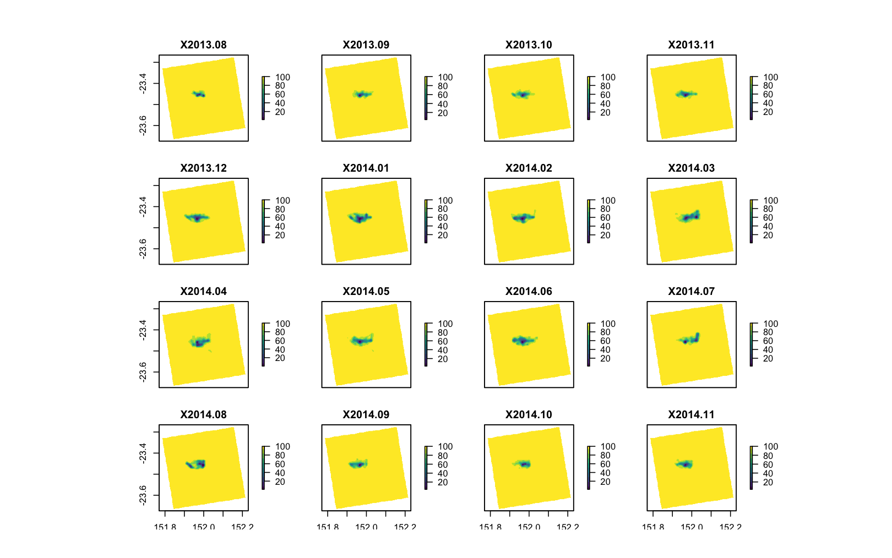
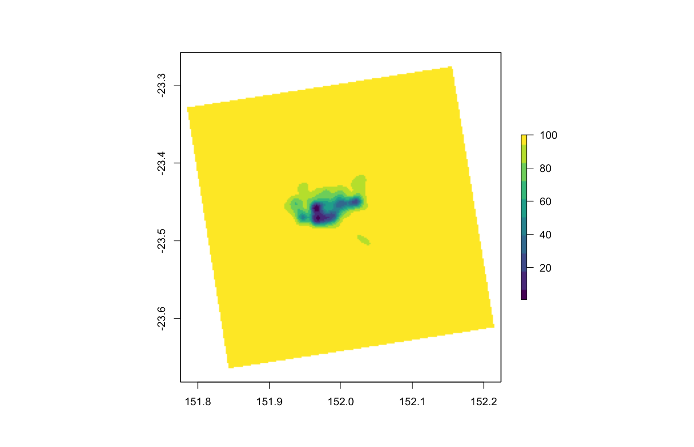

Animal Tracking Toolbox Quick Guide
===================================

Background
------------

Passive telemetry studies use detection patterns of a tagged animal
within a fixed array to understand movement patterns, habitat use and
activity space. Raw detection data are typically used to calculate
metrics of detection (i.e. number of detections, number of days
detected, number of receivers tag was detected on, index of residence),
dispersal (e.g. distances and bearings between consecutive detections;
step distances and turning angles, distances and bearings between each
detection and release site) and activity space (e.g. Minimum Convex
Polygon MCP area, Kernel Utilisation Distribution area), however the
techniques and parameters used to calculate these metrics are often
customised to each study making cross-study comparisons unreliable. Here
we provide a tool to facilitate a standardised workflow to calculate these
commonly used metrics.

<br>


<sub>Figure 1. Visual summary of workflow to calculate standardised metrics using the Animal Tracking Toolbox.</sub>

<br>
<br>

The Animal Tracking Toolbox (ATT) is a collection of functions created
in the R statistical environment (R Development Core Team 2018) that
calculates standardised metrics of dispersal and activity space from
passive telemetry to enable direct comparisons between animals tracked
within the same study and between studies or locations. The functions
uses detection data alongside tag metadata and receiver
station information to calculate a range of standardised movement and
activity space metrics. This toolbox can be used to calculate and
visualise standardised metrics of movement and activity space within and
between species tracked at multiple locations.

<br>
<br>


<sub>Figure 2. Overall activity space metric plots for multiple species tagged at multiple locations (a) Yellowfin Bream (n=1), (b) Yellowtail Kingfish (n=1), (c) Grey Reef Shark (n=1) and (d) Bull Shark (n=1) output using the ATT. Coloured points represent Centres of Activity (60 min time steps) with darker shapes representing core activity space (50% contour of Brownian bridge kernel utilisation distribution; BBKUD) and lighter shapes representing the extent of activity space (95% contour of BBKUD). Black polygons represent overall Minimum Convex Polygons from detection data. Open circles represent locations of VR2W receivers deployed within the IMOS ATF infrastructure and associated research installations.</sub>

<br>
<br>

The ATT was developed to preprocess and calculate standardised metrics
of dispersal and activity space from large-scale detection data housed in
the Integrated Marine Observing System’s Animal Tracking Facility (IMOS
ATF) national data repository. The ATT accepts detection data exported from the IMOS ATF database (referred
to as `IMOSdata` here, and can be accessed through the [AODN portal](https://portal.aodn.org.au)). The ATT can also 
be used to analyse data exported from the VEMCO data management software VUE (refered to as `VEMCOdata` here). We are currently working on additional
functionality for using the ATT with detection data exported from other passive telemetry networks. 

<br>

This manual will outline the required data formats for input 
tag detection data (either `IMOSdata` or `VEMCOdata`), associated tag metadata (referred to as `taginfo` 
) and receiver station information (`statinfo`). This manual will
also demonstrate how to run the function for a single tag as well as
running the function for a large number of tags.

Installation
------------

Currently the development version can be accessed from GitHub:
``` r
install.packages("devtools")
devtools::install_github("vinayudyawer/ATT")
```
The Animal Tracking Toolbox will be eventually integrated into the 'VTrack' package.


Functions within the toolbox
------------

The Animal Tracking Toolbox is comprised of five main functions that work in series:

1.  **`setData()`** sets up data and produces a single list 'ATT' object so detection data, tag metadata and station information are all in one place. Initialises data for use with other functions in the toolbox.

2.  **`detectionSummary()`** calculates standard detection metrics using an 'ATT' object. Produces a list with detection metrics calculated over the full tag life and within user-defined temporal subset (i.e. monthly and weekly metrics).

3.  **`dispersalSummary()`** calculates standard dispersal metrics using an 'ATT' object. Produces a tibble dataframe with dispersal distance and bearing measurements between consecutive detections as well as between each detection and release location (if provided in 'taginfo').

4.  **`COA()`** estimates short-term Centers of Activity using an 'ATT' object. Based on technique described in [Simpfendorfer et al. 2002](http://www.nrcresearchpress.com/doi/abs/10.1139/f01-191#.WuggLS_L2XQ). Produces a 'COA' tibble dataframe object with centers of activity estimated within user-defined timesteps.

5.  **`HRSummary()`** calculates standardised activity space metrics using a 'COA' object. Produces a list with activity space metrics calculated over the full tag life and within user-defined temporal subsets (i.e. monthly and weekly). Technique of calculating activity space metrics include minimum convex polygons (*MCP*), fixed kernel utilisation distributions (*fKUD*) or Brownian bridge kernel utilisation distributions (*BBKUD*). Cumulative metrics of activity space is also calculated with `cumulative` argument. Spatial polygons and raster objects for further plotting are also produced with `storepoly` argument.

<br>

In addition to these functions, there are additional functions to help plot detection summaries using an abacus plot (**`abacusPlot()`**). We are working on more functions to help visualise dispersal summaries and activity spaces calculated... Watch this space!!

<br>

Input data formats
------------

Analysing passive telemetry data requires three sets of data: Tag detection data (refered to here as either `IMOSdata` or `VEMCOdata`, depending on data source); Tag metadata (`taginfo`); and Receiver metadata (`statinfo`). The ATT was developed to recognise field names from the IMOS ATF database and more generally from a VEMCO VUE database that is commonly used in the field of passive acoustic telemetry. These data formats are detailed below, and can be used as a guide to configure the tag detection data input if the VEMCO or IMOS ATF data formats are not used. The `taginfo` and `statinfo` data formats conforms to the metadata information stored on the IMOS ATF database, and similar formats should be used to store metadata information on animals tagged for analysing passive acoustic telemetry data.

<br>

### Tag detection data formats

#### VEMCO input format (`VEMCOdata`)

| Data field | Description | Required field? |
|:---------- |:----------- |:--------------- |
| Date and Time (UTC) |	Date and time of tag detection (yyyy-mm-dd HH:MM:SS) | Yes |
| Receiver |	Name of acoustic receiver, combines receiver model with its serial number (e.g. VR2W-123456) | Yes |
| Transmitter |	Combination of code map and ping ID (eg. A69-1303-14503) | Yes |
| Sensor Value |	Physical measurement recorded by a tag’s sensor, if applicable (If sensor data hasn’t been converted then sensor_unit = ‘ADC’ and values range from 0 to 255.) | Yes |
| Sensor Unit |	Physical unit associated with sensor values (Either ‘ADC’, ‘°C’, ‘m’ or ‘m/s2’) | Yes |
| Station Name |	Name of receiving station on which the transmitter was detected. Acoustic receivers typically gets deployed multiple times at the same station | Yes |
| Latitude |	Latitude at which receiver was deployed and tag was detected (d.ddd˚) | Yes |
| Longitude |	Longitude at which receiver was deployed and tag was detected (d.ddd˚) | Yes |
| Transmitter Name |	Ping ID of transmitter deployed (e.g. 14503) | No |
| Transmitter Serial |	Manufacturers serial number for deployed transmitter (e.g. 1126413) | No |

<br><br>
#### IMOS ATF input format (`IMOSdata`)

| Data field | Description | Required field? |
|:---------- |:----------- |:--------------- |
| transmitter_id |	Combination of code map and ping ID. Dual sensor tags are associated with multiple transmitter IDs (e.g. A69-9002-12345) | Yes |
| station_name |	Name of receiving station on which the transmitter was detected. Acoustic receivers typically gets deployed multiple times at the same station | Yes |
| receiver_name |	Name of acoustic receiver, combines receiver model with its serial number (e.g. VR2W-123456) | Yes |
| detection_timestamp |	Date and time of tag detection (yyyy-mm-dd HH:MM:SS) | Yes |
| longitude |	Longitude at which receiver was deployed and tag was detected (d.ddd˚) | Yes |
| latitude |	Latitude at which receiver was deployed and tag was detected (d.ddd˚) | Yes |
| sensor_value |	Physical measurement recorded by a tag’s sensor, if applicable (If sensor data hasn’t been converted then sensor_unit = ‘ADC’ and values range from 0 to 255.) | Yes |
| sensor_unit |	Physical unit associated with sensor values (Either ‘ADC’, ‘°C’, ‘m’ or ‘m/s2’) | Yes |
| installation_name |	Name of installation on which the transmitter was detected. An installation typically consists of multiple receiving stations | No |
| FDA_QC |	Quality control flag for the false detection algorithm (1:passed, 2:failed) | No |
| Velocity_QC |	Velocity from previous and next detections both 10 m.s-1? (1:yes, 2:no) | No |
| Distance_QC |	Distance from previous and next detections both < 1000 km? (1:yes, 2:no) | No |
| DetectionDistribution_QC |	Detection occurred within expert distribution area? (1:yes, 2:no, 3:test not performed) | No |
| DistanceRelease_QC |	Detection occurred within 500 km of release location? (1:yes, 2:no) | No |
| ReleaseDate_QC |	Detection occurred before the tag release date? (1:yes, 2:no) | No |
| ReleaseLocation_QC |	Tag release lat/long coordinates within expert distribution area and/or within 500 km from first detection? (1:yes, 2:no) | No |
| Detection_QC |	Composite detection flag indicating the likely validity of detections (1:valid detection, 2:probably valid detection, 3:probably bad detection, 4:bad detection) | No |

<br><br>
### Tag metadata input format (`taginfo`)

Tag metadata input format is based on IMOS ATF metadata structure

| Data field | Description | Required field? |
|:---------- |:----------- |:--------------- |
| tag_id |	Unique tag ID. Dual sensor tags will have different transmitter IDs but the same tag ID. This field is to ensure tags are associated with animals. Can include a character vector or numeric (e.g. "Tigger", A1343, 1345). Individual animals will be differentiated using the unique ID in this field, and will be used as labels in data outputs and graphs from the ATT functions | Yes |
| transmitter_id |	Combination of code map and ping ID (e.g. . A69-9002-12345) | Yes |
| scientific_name |	Tagged species scientific name | Yes |
| common_name |	Tagged species common name | Yes |
| tag_project_name |	Project name under which a tag was registered | Yes |
| release_id |	Unique tag release ID. A given tag ID may be associated with several release IDs if it has been re-deployed. | Yes |
| release_latitude |	Latitude at which tag was deployed (d.ddd˚) | Yes |
| release_longitude |	Longitude at which tag was deployed (d.ddd˚ | Yes |
| ReleaseDate |	Date and time at which tag was deployed (yyyy-mm-dd HH:MM:SS) | Yes |
| tag_expected_life_time_days |	Tag expected life time (days) | Yes |
| tag_status |	Tag status (e.g. deployed, lost, etc) | Yes |
| sex |	Sex of tagged animal (if recorded) | Yes |
| measurement |	Morphometric information of tagged animal (if recorded; e.g. Total length, weight) | Yes |
| sensor_slope |	Slope used in the linear equation to convert raw sensor measurements | No |
| sensor_intercept |	Intercept used in the linear equation to convert raw sensor measurements | No |
| sensor_type |	Type of sensor (Can be pinger, temperature, pressure, or accelerometer) | No |
| sensor_unit |	Physical unit associated with sensor values (Either ‘ADC’, ‘°C’, ‘m’ or ‘m/s2’) | No |
| tag_model_name |	Tag model (e.g. V9, V13-TP, V16-P, V9-A) | No |
| tag_serial_number |	Manufacturers serial number for deployed transmitter (e.g. 1126413) | No |
| dual_sensor_tag |	Is the tag a dual sensor tag (TRUE/FALSE) | No |

<br><br>
### Receiver metadata input format (`statinfo`)

Receiver metadata input format is based on IMOS ATF metadata structure

| Data field | Description | Required field? |
|:---------- |:----------- |:--------------- |
| station_name | Name of receiving station. Acoustic receivers typically gets deployed multiple times at the same station. Station name will be used to differentiate reciever stations rather than Receiver serial numbers as often multiple units are used for each station location (i.e. either replacing damaged receivers or cycling through different receivers when downloading data) | Yes |
| receiver_name | Name of acoustic receiver, combines receiver model with its serial number (e.g. VR2W-123456) | Yes |
| installation_name | Name of installation of which receiver is part of. An installation typically consists of multiple receiving stations | Yes |
| project_name | Project name under which the receiver was registered under | Yes |
| deploymentdatetime_timestamp | Date and time at which receiver was deployed (yyyy-mm-dd HH:MM:SS) | Yes |
| recoverydatetime_timestamp | Date and time at which receiver was recovered/removed (yyyy-mm-dd HH:MM:SS) | Yes |
| station_latitude | Latitude at which receiver was deployed (d.ddd˚) | Yes |
| station_longitude | Longitude at which receiver was deployed (d.ddd˚) | Yes |
| status | Status of receiver (e.g. deployed, lost, damaged, recovered, etc) | Yes |

<br>

Usage
------------

**Load the ATT library**
```ruby
library(ATT)
```


**Setup data for smooth functioning with other ATT functions**
```ruby
## Input example datasets
data(IMOSdata)  ## Detection data exported from IMOS data repository
data(VEMCOdata) ## Detection data exported from a VUE database
data(taginfo)
data(statinfo)

## Setup data for use with the Animal Tracking Toolbox
ATTdata<- setupData(Tag.Detections = IMOSdata, 
                    Tag.Metadata = taginfo, 
                    Station.Information = statinfo, 
                    source="IMOS")
```


**Calculating detection metrics**
```ruby
## Calculate detecion metrics with monthly subsets chosen
detSum<-detectionSummary(ATTdata,  
                         sub = "%Y-%m")
```

`detectionSummary()` outputs a list object with two components, `$Overall`: detection metrics for the full period of the tag and `$Subsetted`: detection metrics for weekly or monthly temporal subsets depending on the `sub` argument. 

```ruby
detSum
$Overall
# A tibble: 11 x 10
    Tag.ID Transmitt… Sci.Name Sex   Bio   Number.of.Detec… Number.of.Stati… Days.Detected Days.at.Liberty
     <int> <fct>      <fct>    <fct> <fct>            <int>            <int>         <int>           <dbl>
 1  4.46e6 A69-1303-… Galeoce… FEMA… NA                   9                4             1             858
 2  5.14e7 A69-9002-… Galeoce… FEMA… FORK…              765               43            82             828
 3  5.14e7 A69-9002-… Galeoce… FEMA… NA                1134               45            64             824
 4  5.14e7 A69-9002-… Galeoce… FEMA… FORK…            16867               30           591             834
 5  5.14e7 A69-9002-… Galeoce… FEMA… FORK…               27                3             2             825
 6  5.14e7 A69-9002-… Galeoce… FEMA… FORK…             2679               39           133             824
 7  5.14e7 A69-9002-… Galeoce… FEMA… FORK…            10386               50           507             824
 8  7.75e7 A69-9002-… Galeoce… FEMA… TOTA…            12988               46           649             832
 9  7.75e7 A69-9002-… Galeoce… FEMA… TOTA…             2706               60           286             832
10  7.75e7 A69-9002-… Galeoce… FEMA… TOTA…            14592               56           742             846
11  7.75e7 A69-9002-… Galeoce… FEMA… TOTA…            16600               71           739             835
# ... with 1 more variable: Detection.Index <dbl>

$Subsetted
# A tibble: 197 x 12
    Tag.ID subset  Transmitt…  Sci.Name   Sex   Bio       Number.of.Detect… Number.of.Stati… Days.Detected
     <int> <fct>   <fct>       <fct>      <fct> <fct>                 <int>            <int>         <int>
 1  4.46e6 2012-12 A69-1303-6… Galeocerd… FEMA… NA                        9                4             1
 2  5.14e7 2012-09 A69-9002-1… Galeocerd… FEMA… FORK LEN…                 1                1             1
 3  5.14e7 2013-04 A69-9002-1… Galeocerd… FEMA… FORK LEN…                14                3             1
 4  5.14e7 2013-06 A69-9002-1… Galeocerd… FEMA… FORK LEN…                63               14             5
 5  5.14e7 2013-07 A69-9002-1… Galeocerd… FEMA… FORK LEN…               154               29            17
 6  5.14e7 2013-08 A69-9002-1… Galeocerd… FEMA… FORK LEN…               113               26            17
 7  5.14e7 2013-10 A69-9002-1… Galeocerd… FEMA… FORK LEN…                16                6             3
 8  5.14e7 2014-02 A69-9002-1… Galeocerd… FEMA… FORK LEN…                 8                2             1
 9  5.14e7 2014-04 A69-9002-1… Galeocerd… FEMA… FORK LEN…                 4                2             1
10  5.14e7 2014-06 A69-9002-1… Galeocerd… FEMA… FORK LEN…               123               15             9
# ... with 187 more rows, and 3 more variables: New.Stations <int>, Days.at.Liberty <int>,
#   Detection.Index <dbl>

## Accessing metrics of detection for full tag life
detSum$Overall

## Accessing metrics of detection for each temporal subset
detSum$Subsetted
```


**Create an abacus plot**
```ruby
abacusPlot(ATTdata)
```


```ruby
## Create a facetted abacus plot for individuals 77523274 and 77523147
abacusPlot(ATTdata, 
           id=c("77523274","77523147"), 
           facet=TRUE)
```


**Calculating dispersal metrics**
```ruby
## Calculate dispersal metrics
dispSum<-dispersalSummary(ATTdata)
```

`dispersalSummary()` outputs a tibble data frame object with step distances and step bearings calculated for each detection. The number of rows will be equal to the raw detection data, therefore it may take longer to process dispersal metrics for a large number of animals or for large datasets.

```ruby
## Accessing metrics of dispersal
dispSum
# A tibble: 78,753 x 24
   Date.Time           Transmitter    Station.Name Receiver    Latitude Longitude Sensor.Value Sensor.Unit
   <dttm>              <fct>          <fct>        <fct>          <dbl>     <dbl>        <int> <fct>      
 1 2012-12-02 17:24:12 A69-1303-64957 OT 7         VR2W-114582    -23.5      152.           NA NA         
 2 2012-12-02 18:08:14 A69-1303-64957 OT 6         VR2W-114539    -23.5      152.           NA NA         
 3 2012-12-02 18:21:28 A69-1303-64957 The Key Hole VR2W-114555    -23.5      152.           NA NA         
 4 2012-12-02 18:22:19 A69-1303-64957 The Key Hole VR2W-114555    -23.5      152.           NA NA         
 5 2012-12-02 18:23:16 A69-1303-64957 The Key Hole VR2W-114555    -23.5      152.           NA NA         
 6 2012-12-02 18:24:27 A69-1303-64957 The Key Hole VR2W-114555    -23.5      152.           NA NA         
 7 2012-12-02 18:25:25 A69-1303-64957 The Key Hole VR2W-114555    -23.5      152.           NA NA         
 8 2012-12-02 19:01:59 A69-1303-64957 OT 5         VR2W-101787    -23.5      152.           NA NA         
 9 2012-12-02 19:02:50 A69-1303-64957 OT 5         VR2W-101787    -23.5      152.           NA NA         
10 2012-09-18 20:26:14 A69-9002-14797 Heron E1     VR2W-114577    -23.4      152.            6 ADC        
# ... with 78,743 more rows, and 16 more variables: Tag.ID <int>, Sci.Name <fct>, Common.Name <fct>,
#   Tag.Project <fct>, Release.Latitude <dbl>, Release.Longitude <dbl>, Release.Date <date>,
#   Tag.Life <int>, Tag.Status <fct>, Sex <fct>, Bio <fct>, Release.Dispersal <dbl>,
#   Release.Bearing <dbl>, Consecutive.Dispersal <dbl>, Consecutive.Bearing <dbl>,
#   Time.Since.Last.Detection <dbl>
```

**Calculating activity space metrics**
```ruby
## First, estimate Short-term center of activities
COAdata<-COA(ATTdata, 
             timestep = 60, ## timestep bin used to estimate centers of activity (in minutes)
             split = TRUE)
```

`COA()` produces a single tibble data frame with centers of activity positions estimated for each timestep bin when `split = FALSE`; and a list object with centers of activity positions for each individual when `split = TRUE`.

```ruby
COAdata
$`4462716`
# A tibble: 3 x 18
# Groups:   Tag.ID [1]
  Tag.ID  TimeStep.coa        Latitude.coa Longitude.coa Sensor.Value.coa Sensor.Unit Number.of.Stations
  <fct>   <dttm>                     <dbl>         <dbl>            <dbl> <fct>                    <int>
1 4462716 2012-12-02 17:00:00        -23.5          152.               NA NA                           1
2 4462716 2012-12-02 18:00:00        -23.5          152.               NA NA                           2
3 4462716 2012-12-02 19:00:00        -23.5          152.               NA NA                           1
# ... with 11 more variables: Number.of.Detections <int>, Sci.Name <fct>, Common.Name <fct>,
#   Tag.Project <fct>, Release.Latitude <dbl>, Release.Longitude <dbl>, Release.Date <date>,
#   Tag.Life <int>, Tag.Status <fct>, Sex <fct>, Bio <fct>

$`51448633`
# A tibble: 215 x 18
# Groups:   Tag.ID [1]
   Tag.ID   TimeStep.coa        Latitude.coa Longitude.coa Sensor.Value.coa Sensor.Unit Number.of.Stations
   <fct>    <dttm>                     <dbl>         <dbl>            <dbl> <fct>                    <int>
 1 51448633 2012-09-18 20:00:00        -23.4          152.              6   ADC                          1
 2 51448633 2013-04-19 08:00:00        -23.4          152.              0   ADC                          1
 3 51448633 2013-04-19 09:00:00        -23.4          152.             39   ADC                          2
 4 51448633 2013-04-19 11:00:00        -23.4          152.             47   ADC                          2
 5 51448633 2013-04-19 12:00:00        -23.4          152.             55   ADC                          2
 6 51448633 2013-06-01 02:00:00        -23.4          152.             11.2 ADC                          1
 7 51448633 2013-06-01 04:00:00        -23.4          152.              0   ADC                          1
 8 51448633 2013-06-01 05:00:00        -23.4          152.             23   ADC                          1
 9 51448633 2013-06-01 06:00:00        -23.4          152.             40   ADC                          1
10 51448633 2013-06-13 04:00:00        -23.4          152.             44   ADC                          1
# ... with 205 more rows, and 11 more variables: Number.of.Detections <int>, Sci.Name <fct>,
#   Common.Name <fct>, Tag.Project <fct>, Release.Latitude <dbl>, Release.Longitude <dbl>,
#   Release.Date <date>, Tag.Life <int>, Tag.Status <fct>, Sex <fct>, Bio <fct>
```


If you need to access COA estimates for a single indiviual you can access them by specifying which 'Tag.ID' you are looking for, for example if we want the COA estimates for individual `77523307`:

```ruby
COAdata$`77523307`
# A tibble: 4,281 x 18
# Groups:   Tag.ID [1]
   Tag.ID   TimeStep.coa        Latitude.coa Longitude.coa Sensor.Value.coa Sensor.Unit Number.of.Stations
   <fct>    <dttm>                     <dbl>         <dbl>            <dbl> <fct>                    <int>
 1 77523307 2013-08-23 14:00:00        -23.4          152.             25   ADC                          2
 2 77523307 2013-08-23 15:00:00        -23.4          152.             33.4 ADC                          1
 3 77523307 2013-08-23 16:00:00        -23.4          152.             18.5 ADC                          1
 4 77523307 2013-08-24 19:00:00        -23.5          152.             31.6 ADC                          1
 5 77523307 2013-08-24 20:00:00        -23.5          152.             33   ADC                          1
 6 77523307 2013-08-24 22:00:00        -23.5          152.             30   ADC                          1
 7 77523307 2013-08-25 02:00:00        -23.4          152.             11.5 ADC                          1
 8 77523307 2013-08-25 10:00:00        -23.5          152.             34   ADC                          1
 9 77523307 2013-08-25 11:00:00        -23.5          152.             30   ADC                          1
10 77523307 2013-08-25 14:00:00        -23.5          152.             40   ADC                          1
# ... with 4,271 more rows, and 11 more variables: Number.of.Detections <int>, Sci.Name <fct>,
#   Common.Name <fct>, Tag.Project <fct>, Release.Latitude <dbl>, Release.Longitude <dbl>,
#   Release.Date <date>, Tag.Life <int>, Tag.Status <fct>, Sex <fct>, Bio <fct>

```


Once COA estimates are estimated we can calculate activity space metrics:
```ruby
## Define projected Coordinate Reference System 
# projected coordinate systems should signify distance in meters so the output area values are in sq meters
# (here epsg:3577 refers to the GDA94 Australian Albers projection)
proj<-CRS("+init=epsg:3577")

## HRSummary() requires calculation of COAs first
## Estimate 100% Maximum Convex Polygon (MCP) areas
mcp_est <- HRSummary(COAdata, 
                     projCRS=proj, 
                     type="MCP", 
                     cont=100,
                     sub = "%Y-%m")
```

`HRSummary()` outputs a list object with two components, `$Overall`: activity space metrics for the full period of the tag and `$Subsetted`: activity space metrics for weekly or monthly temporal subsets depending on the `sub` argument.

```ruby
mcp_est
$Overall
# A tibble: 11 x 10
   Tag.ID   Sci.Name  Common.Name Tag.Project   Release.Date Tag.Life Sex   Bio   Number.of.Detec… MCP.100
   <chr>    <fct>     <fct>       <fct>         <date>          <int> <fct> <fct>            <int>   <dbl>
 1 4462716  Galeocer… Tiger Shark QLD Large Sh… 2010-08-12        858 FEMA… NA                   9 NA     
 2 51448633 Galeocer… Tiger Shark AATAMS Heron… 2012-09-19        824 FEMA… FORK…              765  1.25e8
 3 51448637 Galeocer… Tiger Shark AATAMS Heron… 2012-09-20        824 FEMA… NA                1134  1.25e8
 4 51448725 Galeocer… Tiger Shark AATAMS Heron… 2011-08-08        824 FEMA… FORK…            16867  8.43e7
 5 51448733 Galeocer… Tiger Shark AATAMS Heron… 2011-08-09        824 FEMA… FORK…               27 NA     
 6 51448749 Galeocer… Tiger Shark AATAMS Heron… 2012-02-07        824 FEMA… FORK…             2679  1.25e8
 7 51448845 Galeocer… Tiger Shark AATAMS Heron… 2013-03-14        824 FEMA… FORK…            10386  8.33e7
 8 77523147 Galeocer… Tiger Shark AATAMS Heron… 2013-08-16         NA FEMA… TOTA…            12988  9.86e7
 9 77523274 Galeocer… Tiger Shark AATAMS Heron… 2013-08-22         NA FEMA… TOTA…             2706  1.25e8
10 77523307 Galeocer… Tiger Shark AATAMS Heron… 2013-08-24         NA FEMA… TOTA…            14592  1.23e8
11 77523327 Galeocer… Tiger Shark AATAMS Heron… 2013-08-24         NA FEMA… TOTA…            16600  1.25e8

$Subsetted
# A tibble: 197 x 11
   Tag.ID  subset  Sci.Name  Common.Name Tag.Project   Release.Date Tag.Life Sex   Bio    Number.of.Detec…
   <chr>   <chr>   <fct>     <fct>       <fct>         <date>          <int> <fct> <fct>             <int>
 1 4462716 2012-12 Galeocer… Tiger Shark QLD Large Sh… 2010-08-12        858 FEMA… NA                    9
 2 514486… 2012-09 Galeocer… Tiger Shark AATAMS Heron… 2012-09-19        824 FEMA… FORK …                1
 3 514486… 2013-04 Galeocer… Tiger Shark AATAMS Heron… 2012-09-19        824 FEMA… FORK …               14
 4 514486… 2013-06 Galeocer… Tiger Shark AATAMS Heron… 2012-09-19        824 FEMA… FORK …               63
 5 514486… 2013-07 Galeocer… Tiger Shark AATAMS Heron… 2012-09-19        824 FEMA… FORK …              154
 6 514486… 2013-08 Galeocer… Tiger Shark AATAMS Heron… 2012-09-19        824 FEMA… FORK …              113
 7 514486… 2013-10 Galeocer… Tiger Shark AATAMS Heron… 2012-09-19        824 FEMA… FORK …               16
 8 514486… 2014-02 Galeocer… Tiger Shark AATAMS Heron… 2012-09-19        824 FEMA… FORK …                8
 9 514486… 2014-04 Galeocer… Tiger Shark AATAMS Heron… 2012-09-19        824 FEMA… FORK …                4
10 514486… 2014-06 Galeocer… Tiger Shark AATAMS Heron… 2012-09-19        824 FEMA… FORK …              123
# ... with 187 more rows, and 1 more variable: MCP.100 <dbl>
```


Other types of activity space metrics can also be calculated (e.g. fixed KUD using `type = "fKUD"` and Brownian Bridge KUD using `type = "BBKUD"`. Cumulative activity space metrics across temporal subsets can also be calculated using the `cumulative = TRUE` argument. 

```ruby
##*** Warning: the following might take a little while to run! ***##
## Estimate 50% and 95% fixed Kernel Utilisation Distribution ('fKUD') contour areas with cumulative metrics calculated
fkud_est<-HRSummary(COAdata, 
                   projCRS=proj, 
                   type="fKUD",
                   cont=c(50,95),
                   cumulative=TRUE)  
```

**Storing spatial data associated with activity space metrics**

MCP polygons and probability distributions associated with fKUD and BBKUDs can be stored when `storepoly = TRUE`. This outputs a list object with the two components, `$Overall`: a tibble data frame with activity space metrics for the full period of the tag and `$Subsetted`: a tibble data frame with activity space metrics for weekly or monthly temporal subsets depending on the `sub` argument, but also includes an additional `$Spatial.Objects` list that stores polygons (if calculating MCPs) or probability distribution raster (if calculating fKUD or BBKUD) for full tag life and temporal subsets.

```ruby
## Estimate 20%, 50% and 95% Brownian Bridge Kernel Utilisation Distribution ('BBKUD') contour areas and store polygons
BBkud_est<-HRSummary(COAdata, 
                   projCRS=proj, 
                   type="BBKUD", 
                   cont=c(20,50,95), 
                   storepoly=TRUE)
                   
summary(BBkud_est)
                Length Class  Mode
Overall         12     tbl_df list
Subsetted       13     tbl_df list
Spatial.Objects 11     -none- list
```


The `$Spatial.Objects` list object in itself consists of a nested list. The example object above, `BBkud_est` is structured in this way:

<pre>
`BBkud_est`
    |---> `$Overall`    : tibble data frame with activity space metrics for full tag life
    |---> `$Subsetted`  : tibble data frame with activity space metrics for each temporal subset
    |---> `$Spatial.Objects` : list object with as many components as unique Tag.IDs in the data
                |---> `51448633`
                |---> `77523307`
                          |----> `$BBKUD_full` : a raster object with the BBKUD for the full tag life
                          |----> `$BBKUD_sub`  : a raster stack object with the BBKUD for each temporal subset
                                      |-----> `$X2013.05` : raster object for subset '2013-05' (May 2013)
                                      |-----> `$X2013.06` : raster object for subset '2013-06' (June 2013)
                                      |-----> `$X2013.07` : raster object for subset '2013-07' (July 2013)
</pre>

Each raster object or raster stack can be plotted and manipulated using the `raster` library
```ruby
library(raster)
library(viridis) ## access more color palettes!

## Lets plot the overall BBKUD for Tag.ID `77523307`
plot(BBkud_est
     $ Spatial.Objects
     $ `77523307`
     $ BBKUD_full, 
     col=viridis(10))
```


```ruby
## We can also plot the raster stack for all temporal subsets for Tag.ID `77523307`
plot(BBkud_est
     $ Spatial.Objects
     $ `77523307`
     $ BBKUD_sub, 
     col=viridis(10))
```



```ruby
## If we want to see what our animal is doing in April 2014
plot(BBkud_est
     $ Spatial.Objects
     $ `77523307`
     $ BBKUD_sub
     $ X2014.04, 
     col=viridis(10))
```



***More functions to visualise standardised metrics coming soon!!***

<br>
<br>

Authors
---------------
Vinay Udyawer <br> <v.udyawer@aims.gov.au> <br> Australian Institute of Marine Science

Ross Dwyer <br> <ross.dwyer@uq.edu.au> <br> University of Queensland

Xavier Hoenner <br> <xavier.hoenner@utas.edu.au> <br> Australian Ocean Data Network


Current version
---------------

1.0.1 (18 May 2018)
