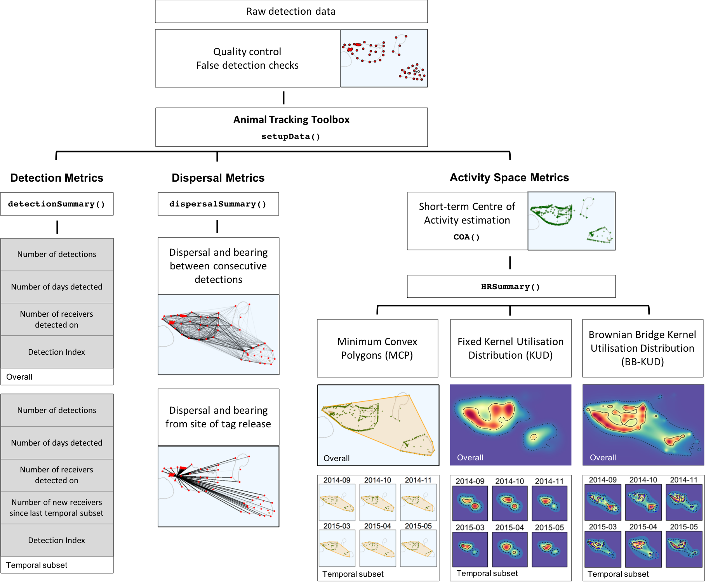
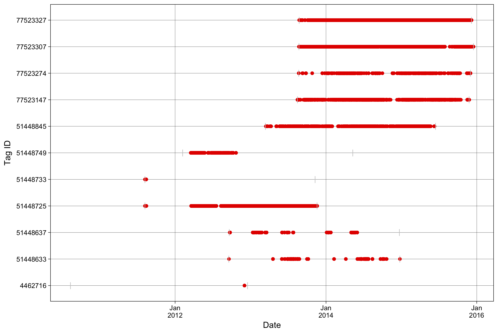
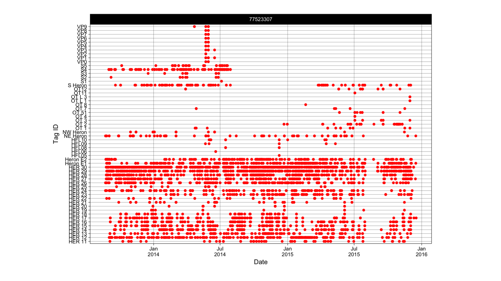

Animal Tracking Toolbox Quick Guide
===================================

Background
------------

Passive telemetry studies use detection patterns of a tagged animal
within a fixed array to understand movement patterns, habitat use and
activity space. Raw detection data are typically used to calculate
metrics of detection (i.e. number of detections, number of days
detected, number of receivers tag was detected on, index of residence),
dispersal (e.g. distances and bearings between consecutive detections;
step distances and turning angles, distances and bearings between each
detection and release site) and activity space (e.g. Minimum Convex
Polygon MCP area, Kernel Utilisation Distribution area), however the
techniques and parameters used to calculate these metrics are often
customised to each study making cross-study comparisons unreliable. Here
we provide a tool to facilitate a standardised workflow to calculate these
commonly used metrics.

<br>


<sub>Figure 1. Visual summary of workflow to calculate standardised metrics using the Animal Tracking Toolbox.</sub>

<br>
<br>

The Animal Tracking Toolbox (ATT) is a collection of functions created
in the R statistical environment (R Development Core Team 2018) that
calculates standardised metrics of dispersal and activity space from
passive telemetry to enable direct comparisons between animals tracked
within the same study and between studies or locations. The functions
uses detection data alongside tag metadata and receiver
station information to calculate a range of standardised movement and
activity space metrics. This toolbox can be used to calculate and
visualise standardised metrics of movement and activity space within and
between species tracked at multiple locations.

<br>
<br>


<sub>Figure 2. Overall activity space metric plots for multiple species tagged at multiple locations (a) Yellowfin Bream (n=1), (b) Yellowtail Kingfish (n=1), (c) Grey Reef Shark (n=1) and (d) Bull Shark (n=1) output using the ATT. Coloured points represent Centres of Activity (60 min time steps) with darker shapes representing core activity space (50% contour of Brownian bridge kernel utilisation distribution; BBKUD) and lighter shapes representing the extent of activity space (95% contour of BBKUD). Black polygons represent overall Minimum Convex Polygons from detection data. Open circles represent locations of VR2W receivers deployed within the IMOS ATF infrastructure and associated research installations.</sub>

<br>
<br>

The ATT was developed to preprocess and calculate standardised metrics
of dispersal and activity space from large-scale detection data housed in
the Integrated Marine Observing System’s Animal Tracking Facility (IMOS
ATF) national data repository. The ATT accepts detection data exported from the IMOS ATF database (referred
to as `IMOSdata` here, and can be accessed through the [AODN portal](https://portal.aodn.org.au)). The ATT can also 
be used to analyse data exported from the VEMCO data management software VUE (refered to as `VEMCOdata` here). We are currently working on additional
functionality for using the ATT with detection data exported from other passive telemetry networks. 

<br>

This manual will outline the required data formats for input 
tag detection data (either `IMOSdata` or `VEMCOdata`), associated tag metadata (referred to as `taginfo` 
) and receiver station information (`statinfo`). This manual will
also demonstrate how to run the function for a single tag as well as
running the function for a large number of tags.

Installation
------------

Currently the development version can be accessed from GitHub:
``` r
install.packages("devtools")
devtools::install_github("vinayudyawer/ATT")
```
The Animal Tracking Toolbox will be eventually integrated into the 'VTrack' package.


Functions within the toolbox
------------

The Animal Tracking Toolbox is comprised of five main functions that work in series:

1.  **`setData()`** sets up data and produces a single list 'ATT' object so detection data, tag metadata and station information are all in one place. Initialises data for use with other functions in the toolbox.

2.  **`detectionSummary()`** calculates standard detection metrics using an 'ATT' object. Produces a list with detection metrics calculated over the full tag life and within user-defined temporal subset (i.e. monthly and weekly metrics).

3.  **`dispersalSummary()`** calculates standard dispersal metrics using an 'ATT' object. Produces a tibble dataframe with dispersal distance and bearing measurements between consecutive detections as well as between each detection and release location (if provided in 'taginfo').

4.  **`COA()`** estimates short-term Centers of Activity using an 'ATT' object. Based on technique described in [Simpfendorfer et al. 2002](http://www.nrcresearchpress.com/doi/abs/10.1139/f01-191#.WuggLS_L2XQ). Produces a 'COA' tibble dataframe object with centers of activity estimated within user-defined timesteps.

5.  **`HRSummary()`** calculates standardised activity space metrics using a 'COA' object. Produces a list with activity space metrics calculated over the full tag life and within user-defined temporal subsets (i.e. monthly and weekly). Technique of calculating activity space metrics include minimum convex polygons (*MCP*), fixed kernel utilisation distributions (*fKUD*) or Brownian bridge kernel utilisation distributions (*BBKUD*). Cumulative metrics of activity space is also calculated with `cumulative` argument. Spatial polygons and raster objects for further plotting are also produced with `storepoly` argument.

<br>

In addition to these functions, there are additional functions to help plot detection summaries using an abacus plot (**`abacusPlot()`**). We are working on more functions to help visualise dispersal summaries and activity spaces calculated... Watch this space!!

<br>

Input data formats
------------

Analysing passive telemetry data requires three sets of data: Tag detection data (refered to here as either `IMOSdata` or `VEMCOdata`, depending on data source); Tag metadata (`tagdata`); and Receiver metadata (`statinfo`). The ATT was developed to recognise field names from the IMOS ATF database and more generally from a VEMCO VUE database that is commonly used in the field of passive acoustic telemetry. These data formats are detailed below, and can be used as a guide to configure the tag detection data input if the VEMCO or IMOS ATF data formats are not used. The `taginfo` and `statinfo` data formats conforms to the metadata information stored on the IMOS ATF database, and similar formats should be used to store metadata information on animals tagged for analysing passive acoustic telemetry data.

<br>

#### Tag detection data formats
<br>
**VEMCO input format**

| Data field | Description | Required field? |
|:---------- |:----------- |:--------------- |
| Date and Time (UTC) |	Date and time of tag detection (yyyy-mm-dd HH:MM:SS) | Yes |
| Receiver |	Name of acoustic receiver, combines receiver model with its serial number (e.g. VR2W-123456) | Yes |
| Transmitter |	Combination of code map and ping ID (eg. A69-1303-14503) | Yes |
| Sensor Value |	Physical measurement recorded by a tag’s sensor, if applicable (If sensor data hasn’t been converted then sensor_unit = ‘ADC’ and values range from 0 to 255.) | Yes |
| Sensor Unit |	Physical unit associated with sensor values (Either ‘ADC’, ‘°C’, ‘m’ or ‘m/s2’) | Yes |
| Station Name |	Name of receiving station on which the transmitter was detected. Acoustic receivers typically gets deployed multiple times at the same station | Yes |
| Latitude |	Latitude at which receiver was deployed and tag was detected (d.ddd˚) | Yes |
| Longitude |	Longitude at which receiver was deployed and tag was detected (d.ddd˚) | Yes |
| Transmitter Name |	Ping ID of transmitter deployed (e.g. 14503) | No |
| Transmitter Serial |	Manufacturers serial number for deployed transmitter (e.g. 1126413) | No |


**IMOS ATF input format**

| Data field | Description | Required field? |
|:---------- |:----------- |:--------------- |
| transmitter_id |	Combination of code map and ping ID. Dual sensor tags are associated with multiple transmitter IDs (e.g. A69-9002-12345) | Yes |
| station_name |	Name of receiving station on which the transmitter was detected. Acoustic receivers typically gets deployed multiple times at the same station | Yes |
| receiver_name |	Name of acoustic receiver, combines receiver model with its serial number (e.g. VR2W-123456) | Yes |
| detection_timestamp |	Date and time of tag detection (yyyy-mm-dd HH:MM:SS) | Yes |
| longitude |	Longitude at which receiver was deployed and tag was detected (d.ddd˚) | Yes |
| latitude |	Latitude at which receiver was deployed and tag was detected (d.ddd˚) | Yes |
| sensor_value |	Physical measurement recorded by a tag’s sensor, if applicable (If sensor data hasn’t been converted then sensor_unit = ‘ADC’ and values range from 0 to 255.) | Yes |
| sensor_unit |	Physical unit associated with sensor values (Either ‘ADC’, ‘°C’, ‘m’ or ‘m/s2’) | Yes |
| installation_name |	Name of installation on which the transmitter was detected. An installation typically consists of multiple receiving stations | No |
| FDA_QC |	Quality control flag for the false detection algorithm (1:passed, 2:failed) | No |
| Velocity_QC |	Velocity from previous and next detections both 10 m.s-1? (1:yes, 2:no) | No |
| Distance_QC |	Distance from previous and next detections both < 1000 km? (1:yes, 2:no) | No |
| DetectionDistribution_QC |	Detection occurred within expert distribution area? (1:yes, 2:no, 3:test not performed) | No |
| DistanceRelease_QC |	Detection occurred within 500 km of release location? (1:yes, 2:no) | No |
| ReleaseDate_QC |	Detection occurred before the tag release date? (1:yes, 2:no) | No |
| ReleaseLocation_QC |	Tag release lat/long coordinates within expert distribution area and/or within 500 km from first detection? (1:yes, 2:no) | No |
| Detection_QC |	Composite detection flag indicating the likely validity of detections (1:valid detection, 2:probably valid detection, 3:probably bad detection, 4:bad detection) | No |


**Tag metadata input format**

Tag metadata input format is based on IMOS ATF metadata structure

| Data field | Description | Required field? |
|:---------- |:----------- |:--------------- |
| tag_id |	Unique tag ID. Dual sensor tags have different transmitter IDs but the same tag ID. | Yes |
| transmitter_id |	Combination of code map and ping ID (e.g. . A69-9002-12345) | Yes |
| scientific_name |	Tagged species scientific name | Yes |
| common_name |	Tagged species common name | Yes |
| tag_project_name |	Project name under which a tag was registered | Yes |
| release_id |	Unique tag release ID. A given tag ID may be associated with several release IDs if it has been re-deployed. | Yes |
| release_latitude |	Latitude at which tag was deployed (d.ddd˚) | Yes |
| release_longitude |	Longitude at which tag was deployed (d.ddd˚ | Yes |
| ReleaseDate |	Date and time at which tag was deployed (yyyy-mm-dd HH:MM:SS) | Yes |
| tag_expected_life_time_days |	Tag expected life time (days) | Yes |
| tag_status |	Tag status (e.g. deployed, lost, etc) | Yes |
| sex |	Sex of tagged animal (if recorded) | Yes |
| measurement |	Morphometric information of tagged animal (if recorded; e.g. Total length, weight) | Yes |
| sensor_slope |	Slope used in the linear equation to convert raw sensor measurements | No |
| sensor_intercept |	Intercept used in the linear equation to convert raw sensor measurements | No |
| sensor_type |	Type of sensor (Can be pinger, temperature, pressure, or accelerometer) | No |
| sensor_unit |	Physical unit associated with sensor values (Either ‘ADC’, ‘°C’, ‘m’ or ‘m/s2’) | No |
| tag_model_name |	Tag model (e.g. V9, V13-TP, V16-P, V9-A) | No |
| tag_serial_number |	Manufacturers serial number for deployed transmitter (e.g. 1126413) | No |
| dual_sensor_tag |	Is the tag a dual sensor tag (TRUE/FALSE) | No |


**Receiver metadata input format**

Receiver metadata input format is based on IMOS ATF metadata structure

| Data field | Description | Required field? |
|:---------- |:----------- |:--------------- |
| station_name | Name of receiving station. Acoustic receivers typically gets deployed multiple times at the same station | Yes |
| receiver_name | Name of acoustic receiver, combines receiver model with its serial number (e.g. VR2W-123456) | Yes |
| installation_name | Name of installation of which receiver is part of. An installation typically consists of multiple receiving stations | Yes |
| project_name | Project name under which the receiver was registered under | Yes |
| deploymentdatetime_timestamp | Date and time at which receiver was deployed (yyyy-mm-dd HH:MM:SS) | Yes |
| recoverydatetime_timestamp | Date and time at which receiver was recovered/removed (yyyy-mm-dd HH:MM:SS) | Yes |
| station_latitude | Latitude at which receiver was deployed (d.ddd˚) | Yes |
| station_longitude | Longitude at which receiver was deployed (d.ddd˚) | Yes |
| status | Status of receiver (e.g. deployed, lost, damaged, recovered, etc) | Yes |

<br>

Usage
------------

Load the ATT library
```ruby
library(ATT)
```

Setup data for smooth functioning with other ATT functions
```ruby
## Input example datasets
data(IMOSdata)  ## Detection data exported from IMOS data repository
data(VEMCOdata) ## Detection data exported from a VUE database
data(taginfo)
data(statinfo)

## Setup data for use with the Animal Tracking Toolbox
ATTdata<- setupData(Tag.Detections = IMOSdata, 
                    Tag.Metadata = taginfo, 
                    Station.Information = statinfo, 
                    source="IMOS")
```

Calculating detection metrics
```ruby
## Calculate detecion metrics with monthly subsets chosen
detSum<-detectionSummary(ATTdata, sub = "%Y-%m")

## Accessing metrics of detection for full tag life
detSum$Overall

## Accessing metrics of detection for each temporal subset
detSum$Subsetted

## Create an abacus plot
abacusPlot(ATTdata)

```


```ruby
## Create a facetted abacus plot for individuals 77523274 and 77523147
abacusPlot(ATTdata, 
           id=c("77523274","77523147"), 
           facet=TRUE)
```


Calculating dispersal metrics
```ruby
## Calculate dispersal metrics
dispSum<-dispersalSummary(ATTdata)

## Accessing metrics of dispersal
dispSum

```

Calculating activity space metrics
```ruby
## First, estimate Short-term center of activities
COAdata<-COA(ATTdata)

## Define projected Coordinate Reference System 
# (here epsg:3577 refers to the GDA94 Australian Albers projection)
proj<-CRS("+init=epsg:3577")

## HRSummary() requires calculation of COAs first
## Estimate 100% MCP areas
mcp_est <- HRSummary(COAdata, 
                     projCRS=proj, 
                     type="MCP", 
                     cont=100)

##*** Warning: the following might take a while to run! ***##
## Estimate 50% and 95% fKUD areas with cumulative metrics calculated
kud_est<-HRSummary(COAdata, 
                   projCRS=proj, 
                   type="fKUD", 
                   cumulative=TRUE)  

## Estimate 20%, 50% and 95% BBKUD contour areas and store polygons
kud_est<-HRSummary(COAdata, 
                   projCRS=proj, 
                   type="BBKUD", 
                   cont=c(20,50,95), 
                   storepoly=TRUE)

```
***More functions to visualise standardised metrics coming soon!!***

<br>
<br>

Authors
---------------
Vinay Udyawer <br> <v.udyawer@aims.gov.au> <br> Australian Institute of Marine Science

Ross Dwyer <br> <ross.dwyer@uq.edu.au> <br> University of Queensland

Xavier Hoenner <br> <xavier.hoenner@utas.edu.au> <br> Australian Ocean Data Network


Current version
---------------

1.0.0 (1 May 2018)
